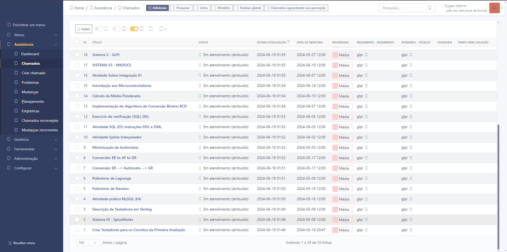

# Introdução ao GLPI

## Instalação do GLPI

Como já vimos, o **GLPI** é um sistema de gerenciamento de TI. Nele você pode adicionar ativos, chamados, criação de usuários, etc. Há mais funcionalidades nele porém vamos para o processo de como podemos instalar o GLPI. Diante mão já venho dizer que há três maneiras básicas de instalar o **GLPI**, são elas:   
 
### Algumas formas de instalar
 - [XAMPP](https://www.apachefriends.org/pt_br/index.html): O XAMPP é uma distribuição do Apache fácil de instalar contendo PHP, MySQL e Perl. 
 - [WSL](https://learn.microsoft.com/pt-br/windows/wsl/): Subsistema Windows para Linux.
 - [VitualBox](https://www.virtualbox.org/): Uma VM é uma representação virtual de um computador físico.

## Processo de instalação e configuração

### Primeiro Passo

Eu utilizei o **XAMPP** para usar o GLPI, pois eu queria ver como ele iria conseguir executar o GLPI. **Primeiro passo** é instalar o [XAMPP](https://www.apachefriends.org/pt_br/download.html). Quando você entrar no site haverá três opções, no meu caso eu usei a versão do windows:

| Versão  | Soma de verificação | tamanho |
| --------| -------------       | -------- |
| 8.0.30 / PHP 8.0.30   | md5 sha1    | 144mb    |

Como o XAMPP instalado agora você tem que baixar uma pasta do [GLPI](https://glpi-project.org/pt-br/baixar/) **A versão mais recente estável**, que é a  GLPI 10.0.15. Agora temos tudo que precisamos para utilizar o GLPI.

### Segundo Passo

Na **segunda parte** agora você vai ter que pegar a pasta GLPI que você baixou e extrair ela. Após extrair a pasta, você vai recotar ela e ir para a pasta do **XAMPP**.

Localize a pasta htdocs, bote a pasta que você recortou dentro dela, e agora o **XAMPP** vai conseguir usar as funcionalidades do GLPI. 

### Terceiro Passo

Agora temos tudo que precisamos para utilizar o **GLPI**. Primeiro clique em start tanto no **Apache** como no **mySQL**, após isso você pode ir no seu navegador principal e bote a `URL: http://localhost/glpi`, quando você botar isso você será direcionando para a aba principal do **GLPI**.

#### Primeiro Passo GLPI

No **Primeiro passo** ele vai pedir que tipo de linguagem você quer definir como padrão para o seu sistema. No meu caso eu utlizei a linguagem portuguesa mesmo.

#### Segundo Passo GLPI

No **Segundo passo** haverá um nota de licença do  **GLPI**, só aperte o botão **Continuar** e você irá para o terceiro passo.

#### Terceiro Passo GLPI

No **Terceiro passo** você terá duas opções **Instalar** e **Atualizar**, se você fez tudo que eu lhe falei até o momento, aperte no botão de instalar.

#### Quarto Passo GLPI

Após isso você perceberá que vai haver várias coisas faltando no seu setup, porém você só precisará alterar duas para que o seu sistema esteja pronto. Veja abaixo :arrow_down:

[Referência da imagem](https://www.youtube.com/watch?v=7-CqrK9pxz4&t=9s)

Veja que o **gd** e o **intl** não estão no seu sistema. Neste caso você terá que adicionar eles. Vá no **Module Apache**, como fizemos na outra vez e de novo entre no **config** do **php.ini**. Localize o **gd** e o **intl** dentro do arquivo, pois possivelmente eles estarão comentado. Descomente eles e salva o arquivo no bloco de notas. Atualize o navegador e agora você pode ir para a próxima etapa, somente clicando em **Continuar**.

#### Quinto Passo GLPI

Agora você irar criar uma conexão com  o banco de dados para armazenar seus arquivos.

| Enderço do servidor  | Usuário SQL | Senha |
| --------| -------------       | -------- |
| localhost | root    | não precisa   |

Feito isto, clique em **Continuar**

#### Sexto Passo GLPI

Agora ele vai pedir para você criar um banco de dados. Você pode botar qualquer nome para o seu banco, no meu caso eu botei *glpi*, após isso, aperte em **Continuar**.

#### Sétimo Passo GLPI

Ele vai perguntar se pode fazer agora a criação do banco de dados,  aperte em **Continuar**.

#### Oitavo Passo GLPI

Ele vai pedir a coleta de dados, aperte em **Continuar**.

#### Nono Passo GLPI

Finalmente ele vai perguntar se você deseja utilizar o **GLPI** :relieved:. Aperte em **Usar o GLPI**.

#### Décimo Passo  GLPI

Agora é só entrar no sistema e configurar de acordo com o que você deseja.

| Nome do utilizador  | Palavra passe | 
| --------| -------------       | 
| glpi | glpi    | 

**Utilize o que está acima para entrar como administrador no seu sistema GLPI**.

### Quarto Passo

Se você chegou até aqui, você finalmente vai pode utilizar o seu sistema glpi e fazer chamados, veja como ficou o meu abaixo:

Caso você ainda tenha problemas, [CLIQUE AQUI](https://www.youtube.com/watch?v=7-CqrK9pxz4&t=9s) para mais informações sobre esse mesmo processo

